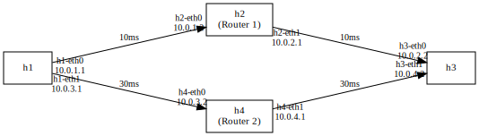

### 实验一：使用MPTCP

#### 仿真拓扑


#### 实验步骤
1. 运行脚本mptcp.py
2. h3为服务端，h1为客户端；h1通过iperf3向h3发送请求
    ```bash
    ## 使用mptcpize run运行iperf3保证使用MPTCP协议
    - h3 mptcpize run iperf3 -s &
    - h1 mptcpize run iperf3 -c 10.0.2.2 -t 10 ## 抓包后再执行
    ```
    
3. 在h1的两个接口抓包
    ```bash
    - xterm h1 h1   ## 打开两个h1终端
    - tcpdump -i h1-eth0 -w h1-path1.pcap
    - tcpdump -i h1-eth1 -w h1-path2.pcap
    ```
    

#### 实验结果
- 抓包结果如下
    
- 可以看到两个接口都成功抓取到了数据包，证明确实使用了MPTCP协议